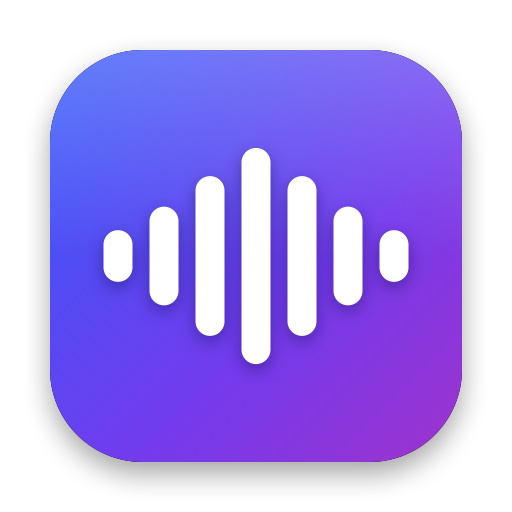

<p align="center">
  
</p>

<h1 align="center">Vadic</h1>

<p align="center">
  Push-to-talk dictation for macOS that runs entirely on your Mac.<br>
  Hold a key, speak, release: the text is typed into whatever field has focus.
</p>

<p align="center">
  <a href="https://github.com/mikhail-angelov/vadic/actions/workflows/ci.yml"></a>
  <a href="https://github.com/mikhail-angelov/vadic/releases/latest"></a>
  
  
</p>

---

## Features

- **Local and private.** Speech is recognized on your Mac by [whisper.cpp](https://github.com/ggml-org/whisper.cpp) (`large-v3-turbo`) on the GPU. No audio or text leaves the machine.
- **Works in any app.** Text is typed as keystrokes, so it lands in browsers, chats, editors and terminals, and your clipboard stays untouched.
- **Your vocabulary.** Terms you list keep their spelling, and replacement rules fix words the model keeps getting wrong.
- **Quiet microphones are fine.** Recordings are normalized before recognition, and voice activity detection drops noise so a cough or a key click never turns into made-up text.
- **Unobtrusive.** A menu-bar icon and a small overlay at the bottom of the screen while you speak. Other apps' audio is muted while you record.

## Install

### Homebrew (recommended)

```sh
brew install --cask mikhail-angelov/tap/vadic
open -a Vadic
```

This installs `whisper-cpp` as well, puts Vadic in `/Applications` and clears the macOS quarantine flag. Homebrew can't start apps itself, so open Vadic once; from then on it starts with macOS.
Update with `brew upgrade --cask vadic`: Vadic notices the new version and restarts into it. `brew uninstall --cask vadic` removes the app; add `--zap` to delete the downloaded models, settings and history too.

### Manual download

1. Install whisper.cpp: `brew install whisper-cpp`.
2. Grab `Vadic-<version>-macos-arm64.dmg` from the [latest release](https://github.com/mikhail-angelov/vadic/releases/latest), open it and drag **Vadic** onto **Applications**.
3. Vadic isn't notarized by Apple, so macOS blocks the first launch. Remove the quarantine flag once:

   ```sh
   xattr -dr com.apple.quarantine /Applications/Vadic.app
   ```

### First launch

1. **Grant the two permissions** Vadic asks for, then restart it:
   - **Microphone**, to hear you;
   - **Accessibility**, to type the text into other apps (System Settings → Privacy & Security → Accessibility).
2. **Wait for the model.** Vadic downloads the speech model (574 MB) and the voice-activity model into `~/Library/Application Support/Vadic/Models` and checks their checksums; progress shows in the menu and the overlay. Models live outside the app, so reinstalling or upgrading never downloads them again. If [VoiceInk](https://github.com/Beingpax/VoiceInk) has already downloaded `large-v3-turbo-q5_0`, Vadic reuses it.

## Usage

1. Put the cursor where the text should go.
2. **Hold the right Option key** and speak.
3. **Release.** The overlay shows *Transcribing…*, then the text is typed in.

Tips:

- A short accidental press, or silence, inserts nothing.
- Pressing any other key while holding the hotkey cancels the recording, so right Option still works for shortcuts.
- A recording stops by itself after 20 minutes and is transcribed as usual.
- If typing fails, the text is left on the clipboard, so nothing you said is lost.

The menu-bar icon shows the state: ready, transcribing, downloading or an error. Its menu has the last dictation, **Open Config**, **Reload Config**, **Open History**, **Launch at Login** and **Quit Vadic**.

Vadic starts with macOS: on its first launch it adds itself to System Settings → General → Login Items. Uncheck **Launch at Login** in its menu, or switch it off in System Settings, and it stays off. Install Vadic in `/Applications` before the first launch (Homebrew does), so the login item points at its final location.

## Configuration

Settings live in `~/Library/Application Support/Vadic/config.json`, created on first launch. Edit it, then choose **Reload Config** in the menu. Keys you leave out fall back to their defaults.

| Key | Default | Meaning |
|---|---|---|
| `hotkey` | `rightOption` | `rightOption`, `rightCommand`, `rightControl` or `fn` |
| `language` | `ru` | Spoken language |
| `stylePrompt` | a Russian greeting | A sentence in the spoken language that primes punctuation and capitals |
| `vocabulary` | sample terms | Terms that keep their spelling; Whisper gets `stylePrompt` + vocabulary as its prompt |
| `replacements` | sample rules | `[{"from": ["kew drant"], "to": "Qdrant"}]`, applied after recognition: case-insensitive, whole words, space and hyphen interchangeable |
| `insertMode` | `type` | `type` (keystrokes, clipboard untouched), `paste` (Cmd+V, clipboard restored) or `clipboard` (only copy) |
| `appendSpace` | `true` | Add a space after the text so consecutive dictations don't run together |
| `pressReturn` | `false` | Press Return after inserting, to send a chat message |
| `overlay` | `true` | Floating indicator at the bottom of the screen |
| `muteWhileRecording` | `true` | Mute system output while recording |
| `maxRecordingMinutes` | `20` | A recording stops and is transcribed after this long |
| `keepAudio` | `true` | Keep the audio of each dictation in the history |
| `audioRetentionDays` | `1` | Delete audio older than this; `0` keeps it forever |
| `historyRetentionDays` | `30` | Delete history entries older than this; `0` keeps them forever |
| `engine.modelPath` | `Models/ggml-large-v3-turbo-q5_0.bin` | Whisper model |
| `engine.vadModelPath` | `Models/ggml-silero-v5.1.2.bin` | Voice-activity model; `null` turns VAD off |
| `engine.serverURL` | `http://127.0.0.1:8178` | Where Vadic runs `whisper-server` |

## Files

Everything is under `~/Library/Application Support/Vadic/`:

- `config.json`: settings;
- `History/<timestamp>/`: `audio.wav`, `text.txt` and `meta.json` for each dictation;
- `Models/`: downloaded models;
- `whisper-server.log`: speech-server log.

## Build from source

Requires Xcode 26 (Swift 6.2) and `brew install whisper-cpp`.

```sh
./scripts/build-app.sh      # → build/Vadic.app
open build/Vadic.app
```

Ad-hoc builds pin the code signature's designated requirement to the bundle id, so macOS keeps the permissions across rebuilds. Set `SIGN_IDENTITY=<certificate>` to sign with a real certificate.

Tests:

```sh
swift test                  # unit tests
VADIC_IT=1 swift test       # plus tests against a real whisper-server and HuggingFace
```

`scripts/make-icon.sh` regenerates the app icon. Design notes and measurements are in [`docs/SPEC.md`](docs/SPEC.md); the planned meeting recorder is in [`docs/SPEC-meetings.md`](docs/SPEC-meetings.md).

## Releases

CI runs on every push to `master`. Pushing a `v*` tag builds the app and publishes a GitHub Release with a DMG, a zip and their SHA-256 (`scripts/package.sh` does the packaging):

```sh
git tag v0.1.0 && git push origin v0.1.0
```

## License

[MIT](LICENSE)
